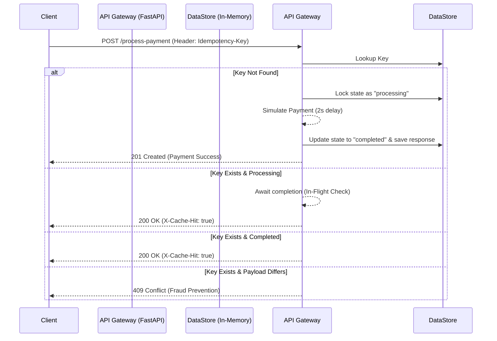

```markdown
# FinSafe Idempotency Gateway

An API middleware service designed to prevent double-charging in payment processing by implementing the "Pay-Once" protocol using an Idempotency Layer.

## 📐 Architecture Diagram



## 🛠️ Setup Instructions

This project requires **Python 3.8+**.

1. **Clone the repository:**
   ```bash
   git clone <YOUR_REPO_LINK_HERE>
   cd idempotency-gateway
   ```

2. **Create and activate a virtual environment:**
   ```bash
   python -m venv venv
   source venv/bin/activate  # On Windows: venv\Scripts\activate
   ```

3. **Install dependencies:**
   ```bash
   pip install -r requirements.txt
   ```

4. **Run the server:**
   ```bash
   uvicorn main:app --reload
   ```
   The server will start at `http://127.0.0.1:8000`.

## 📖 API Documentation

### 1. Process Payment
Simulates processing a transaction securely. 

- **URL:** `/process-payment`
- **Method:** `POST`
- **Headers:** - `Idempotency-Key` (String, Required): A unique identifier for the transaction.

**Request Body (JSON):**
```json
{
  "amount": 100,
  "currency": "GHS"
}
```

**Responses:**

* **201 Created:** (First successful request)
    ```json
    { "status": "Charged 100.0 GHS" }
    ```
* **200 OK:** (Duplicate request with same payload)
    * *Headers included:* `X-Cache-Hit: true`
    ```json
    { "status": "Charged 100.0 GHS" }
    ```
* **409 Conflict:** (Duplicate request, but payload has changed)
    ```json
    { "detail": "Idempotency key already used for a different request body." }
    ```

## 🧠 Design Decisions

* **FastAPI Framework:** Chosen for its asynchronous capabilities (crucial for handling the "In-Flight" bonus story efficiently without blocking threads) and native data validation via Pydantic.
* **Payload Hashing:** Instead of storing and comparing entire JSON strings, the system generates an SHA-256 hash of the incoming payload. This ensures fast $O(1)$ lookups and secure comparison for User Story 3 (Fraud Check).
* **Async/Await Polling:** For the "In-Flight" check, `asyncio.sleep` is used to poll the state. This prevents race conditions when concurrent requests hit the server, forcing secondary requests to yield control back to the event loop until the primary request finishes.

## 🚀 The Developer's Choice: Key Expiration (TTL)

**Added Feature:** Automatic cache invalidation based on Time-To-Live (TTL).

**Why I added it:**
In a production Fintech environment, idempotency keys should only be valid for a specific window (e.g., 24 hours). If we keep every key forever, an in-memory datastore (or Redis cache) will eventually suffer from memory exhaustion (OOM errors). I implemented a mechanism that records the `created_at` timestamp. Before every new request is processed, a cleanup function sweeps the database and removes keys older than `KEY_TTL_SECONDS` (set to 1 hour for this demo). This ensures the system remains performant and memory-efficient at scale.
```